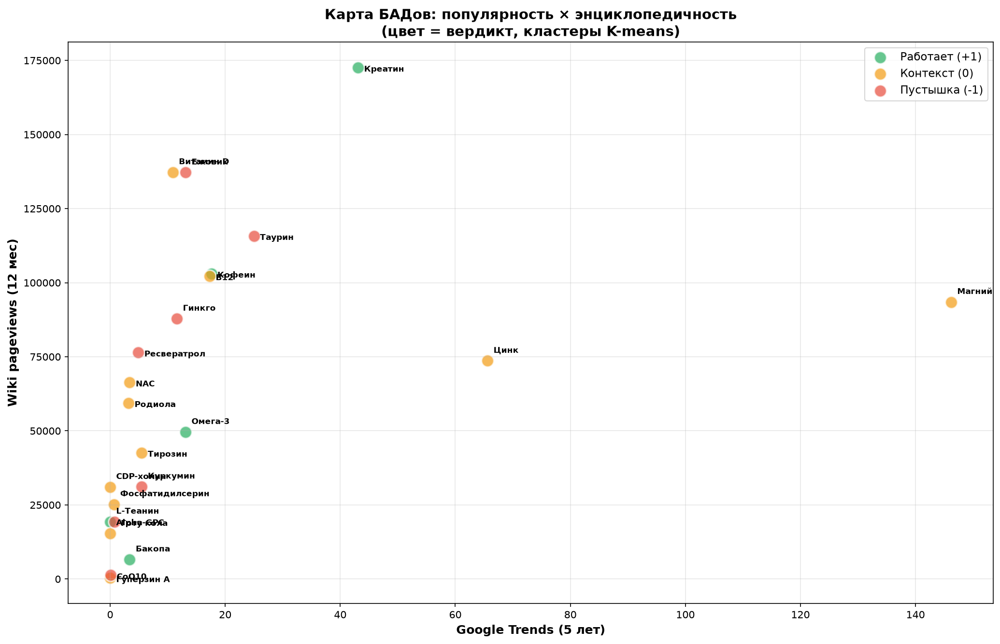

# 🧠 БАДы для мозга: 25 добавок под микроскопом данных

Автоматический анализ рынка ноотропов: наука × спрос × цена.
Три независимых источника спроса, мета-анализы PubMed, 15 автотестов.

[](tests/)
[](data/processed/evidence_scored.csv)
[](LICENSE)

## TL;DR — 5 выводов, которые стоят денег

1. Ежовик гребенчатый — чемпион хайпа (индекс 2.62): топ-3 поискового
   и энциклопедического спроса при нуле мета-анализов по когнитивке в PubMed.
2. Рынок иногда голосует за науку: бестселлеры Wildberries —
   L-теанин (297 236 отзывов) и креатин (191 221) — обе с вердиктом «работает».
3. Популярность ≠ доказательность: корреляция поиск × score = +0.18.
   Но просмотры Википедии умеренно коррелируют с наукой (+0.46) —
   энциклопедический интерес ближе к истине, чем потребительский.
4. Сезонность — лакмусовая бумажка: витамин D ищут зимой (×1.23, биология),
   а ежовик — летом (×0.78): это маркетинговый цикл, а не потребность тела.
5. Где вы переплачиваете: CDP-холин +224% к «справедливой» цене,
   пикногенол +215% (вердикт «пустышка»). Недооценены: витамин D (−74%),
   кофеин (−66%) — дешёвые и доказанные.

## Главная карта



4 кластера K-means по «популярность × энциклопедичность × наука».
Кластер «хайп-гигантов» (креатин, таурин, ежовик): 2 из 3 — пустышки.

## Методология

| Слой | Источник | Что считаем |
|---|---|---|
| Наука | PubMed E-utilities | RCT + мета-анализы → score; вердикты сверены с топ-2 MA ([verdict_sources.csv](data/processed/verdict_sources.csv), 25/25) |
| Спрос №1 | Google Trends (pytrends, RU, 5 лет) | поисковый интерес + сезонность |
| Спрос №2 | Wildberries API | цены/мес, отзывы, рейтинги |
| Спрос №3 | Wikimedia pageviews API | энциклопедический интерес, 12 мес |
| Экономика | расчёт | цена/мес по дозировкам, категории, индекс справедливой цены |
| QA | pytest | 15 тестов: словари, регулярки, экономика, свежесть данных |

## Структура

```
brain-25-evidence/
├── src/            # parsers.py, economics.py, config.py
├── notebooks/      # 01 сбор → 02 анализ → 03 экономика
├── data/raw/       # prices_wb.xlsx, wb_demand.csv
├── data/processed/ # evidence_scored.csv, verdict_sources.csv
├── tests/          # pytest-набор
└── reports/        # графики для статей
```

## Быстрый старт

```bash
pip install -r requirements.txt
python -m pytest -q        # 15 passed
# ноутбуки выполняются сверху вниз без ошибок
```

## Известные ограничения (честно)

- Вердикты — консенсус Examine.com + топ-2 мета-анализов PubMed, не собственные RCT.
- У 3 добавок мета-анализов по когнитивке **нет вообще** (ежовик, NAC, тирозин) —
  это зафиксировано как данные, а не как дыра.
- WB-спрос собран на 11/25 добавок (антибот-блок маркетплейса); добор — в v1.1.
- Цены WB — снимок на дату сбора; обновление — скриптом раз в квартал.

## Лицензия

MIT. Данные и код свободны к использованию со ссылкой на репозиторий.

🕸️ Интерактивная карта механизмов v1.0: https://deadsno.github.io/brain-25-evidence/