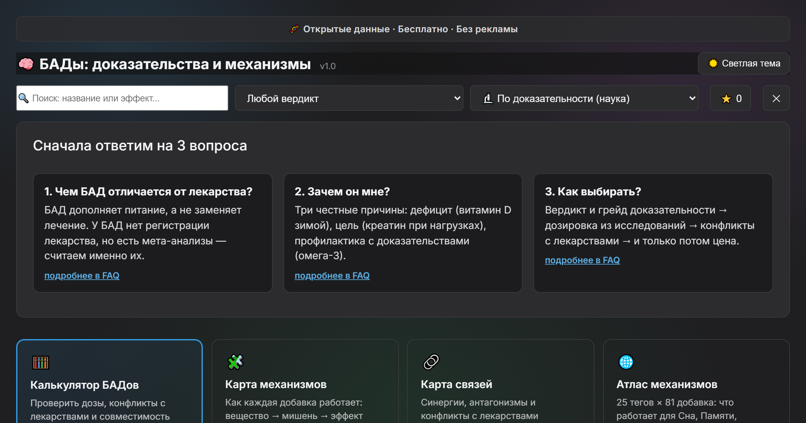

# БАДы: цена vs наука

> Интерактивный дашборд и карта механизмов для 41 биологически активной добавки.
> Вердикты по мета-анализам PubMed, цены за месяц с Wildberries, активные клинические испытания.

[Открыть сайт](https://deadsno.github.io/brain-25-evidence/) | [Карта механизмов](https://deadsno.github.io/brain-25-evidence/map.html) | [Задать вопрос](https://github.com/DeadSno/brain-25-evidence/issues/new/choose)




---

## Оглавление

1. [Что это и зачем](#что-это-и-зачем)
2. [Быстрый старт](#быстрый-старт)
3. [Главные находки](#главные-находки)
4. [Методология](#методология)
5. [Данные](#данные)
6. [Структура репозитория](#структура-репозитория)
7. [Локальный запуск](#локальный-запуск)
8. [Автообновление цен](#автообновление-цен)
9. [Roadmap](#roadmap)
10. [Как помочь проекту](#как-помочь-проекту)
11. [Дисклеймер и лицензия](#дисклеймер-и-лицензия)

---

## Что это и зачем

**Зачем этот проект:** рынок БАДов в России — это миллиарды рублей в год. Большинство покупок делается по рекламе и советам блогеров, но наука часто говорит противоположное: часть добавок работает только при дефиците, часть — только у пациентов, а часть — маркетинг без единого доказательства на людях.

**Что мы показываем для каждой из 41 добавки:**

| Что показываем | Зачем это знать | Источник |
|---|---|---|
| Индекс доказательности | Сколько науки стоит за добавкой | PubMed E-utilities |
| Вердикт (+1 / 0 / -1) | Работает / зависит / не подтверждено | Ручная вычитка топ-2 мета-анализов |
| Цена за месяц | Сколько реально платишь | Wildberries (медиана) |
| Ценность | Сколько науки за 100 руб. | Расчётная величина |
| Активных испытаний | Тестирует ли кто-то сейчас | ClinicalTrials.gov |
| Дозировка и предостережения | Как принимать безопасно | Протоколы из исследований |

---

## Быстрый старт

**Хочешь посмотреть результаты?** Открой [сайт](https://deadsno.github.io/brain-25-evidence/) — фильтры, поиск, модалки, радар сравнения.

**Хочешь увидеть механизмы?** [Карта механизмов](https://deadsno.github.io/brain-25-evidence/map.html) — добавка -> мишень в организме -> эффект, с цветовой кодировкой доказательности.

**Хочешь поспорить с методологией?** Раздел [Методология](#методология) и [issues](https://github.com/DeadSno/brain-25-evidence/issues/new/choose).

**Хочешь запустить у себя?** Раздел [Локальный запуск](#локальный-запуск).

---

## Главные находки

Мы посчитали 4 ключевых корреляции и распределение вердиктов по категориям.

### Корреляции (наука x рынок)

| Связь | Коэфф. | n | Вывод |
|---|---|---|---|
| Наука x Цена | **-0.34** | 24 | Дорогие добавки **не** научнее дешёвых |
| Наука x Отзывы WB | -0.17 | 25 | Самые покупаемые — не самые обоснованные |
| Google Trends x WB | -0.01 | 25 | Ищут **не то**, что покупают |
| Wikipedia x Наука | +0.01 | 41 | Wikipedia — не индикатор научности БАД |

### Распределение по 8 категориям

| Категория | не подтверждено | зависит | работает | Комментарий |
|---|---|---|---|---|
| **Спорт** | 0 | 0 | **2** | 100% рабочих — результат меряется секундами |
| **Когниция** | 8 | 11 | 6 | Самая "грязная" категория, 8 пустышек |
| **Сон** | 2 | 2 | 1 | Работает в основном мелатонин |
| **Иммунитет** | 1 | 2 | 0 | Ноль "работает" у здоровых |
| **Настроение** | 0 | 1 | 1 | Осторожно с 5-HTP и зверобоем |
| **Кожа и суставы** | 0 | 0 | 1 | Коллаген с оговорками |
| **Кишечник** | 0 | 1 | 0 | Пробиотики — горячая тема науки (470 ongoing) |
| **Общее** | 0 | 2 | 0 | Витамины — только при дефиците |

**Топ-5 рабочих:** креатин, кофеин, мелатонин, бакопа, омега-3 (с нюансами).
**Топ-5 пустышек:** ежовик, ГАБА, гинкго, ресвератрол, пикногенол.
**Топ по ценности (наука на 100 руб.):** кофеин, витамин D, креатин.

---

## Методология

**Зачем эта секция:** чтобы любой мог воспроизвести наши выводы или поспорить с ними. Всё прозрачно.

### Индекс науки

```
Индекс = РКИ + 5 x мета-анализы
```

**Как считаем:** PubMed-запрос " `(вещество) AND (конкретный исход)` " с отсечкой ветеринарии и промышленных работ. Мета-анализ весит в 5 раз больше РКИ, потому что объединяет множество исследований.

**Почему так, а не иначе:** индекс меряет **количество** науки, а не силу эффекта. Поэтому параллельно ставим ручной вердикт по топ-2 мета-анализам.

### Вердикты (вручную, по топ-2 мета-анализам)

| Код | Значение | Когда ставим |
|---|---|---|
| +1 работает | стабильный эффект у здоровых | Мета-анализы показывают значимый эффект в общей популяции |
| 0 зависит от контекста | работает при дефиците / у пациентов / в экстриме | Эффект только в подгруппах (дефицит, спортсмены, пожилые) |
| -1 не подтверждено | маркетинг без человеческих доказательств | Нет мета-анализов, или они отрицательные, или только in vitro / на животных |

### Ценность

```
Ценность = индекс науки / (цена за месяц / 100)
```

Показывает, **сколько науки получаешь за 100 руб. в месяц**. Лидеры: кофеин, витамин D, креатин.

### Активные испытания

Источник: [ClinicalTrials.gov API v2](https://clinicaltrials.gov/data-api/about-api). Статусы `RECRUITING`, `ACTIVE_NOT_RECRUITING`, `NOT_YET_RECRUITING`. Ноль испытаний = "маркетинг без будущего": наука либо всё сказала, либо не верит в эффект.

---

## Данные (v1.2, сентябрь 2026)

| Метрика | Значение |
|---|---|
| Добавок | **41** (25 когнитивных + 16 новых) |
| Категорий | 8: когниция, сон, спорт, иммунитет, настроение, кожа/суставы, кишечник, общее |
| Учёных работ учтено | 2000+ (РКИ и мета-анализы PubMed) |
| Активных испытаний | проверены все 41 добавка |
| Цен | 40 из 41 (Wildberries, 70+ товаров) |
| Источники науки | PubMed E-utilities, OpenAlex, Semantic Scholar |

**Почему у одной добавки нет цены (Ашваганда):** на Wildberries моноформы ашваганды в капсулах практически нет — рынок завален комплексами, каплями и косметическим маслом. Подставлять цену комплекса "17 в 1" было бы нечестно.

---

## Структура репозитория

```
brain-25-evidence/
├── docs/                          # статический сайт (GitHub Pages)
│   ├── index.html                 # дашборд: фильтры, поиск, модалки, радар
│   ├── map.html                   # карта механизмов v4 (41 узел)
│   ├── script.js / style.css      # логика и стили (+ мобильная адаптация)
│   ├── data.json                  # данные сайта (ГЕНЕРИРУЕТСЯ, не править руками)
│   └── og.png                     # превью для соцсетей
├── notebooks/                     # jupyter-ноутбуки
│   ├── 01_evidence_pubmed.ipynb   # сбор PubMed / OpenAlex / Wiki / Trends
│   ├── 02_analysis.ipynb          # вердикты, регенерация data.json, карта
│   └── 03_economics.ipynb         # расчёт цен за месяц
├── src/                           # переиспользуемые модули
│   ├── config.py                  # 41 добавка: запросы, нормы, английские имена
│   ├── content.py                 # категории, эффекты, протоколы, формы, механизмы
│   └── parsers.py                 # PubMed, WB, OpenAlex, Wiki, Trends, ClinicalTrials
├── scripts/
│   └── collect_prices.py          # ежедневный сбор цен WB
├── data/
│   ├── raw/                       # сырьё: PubMed, WB, история цен
│   └── processed/                 # evidence_scored_v12.csv и производные
├── reports/                       # черновики: article_draft.md, графики
├── tests/
│   └── test_site_data.py          # страховка: битый data.json не уедет на сайт
└── .github/
    ├── workflows/collect_prices.yml  # cron 06:00 МСК (бот цен)
    └── ISSUE_TEMPLATE/data-error.md  # шаблон сообщений об ошибках
```

---

## Локальный запуск

```bash
# 1. Клонируй
git clone https://github.com/DeadSno/brain-25-evidence.git
cd brain-25-evidence

# 2. Установи зависимости
pip install -r requirements.txt

# 3. Прогони тесты (должно быть 17 passed)
python -m pytest tests/ -q

# 4. Подними сайт локально
cd docs && python -m http.server 8000
# открой http://localhost:8000
```

---

## Автообновление цен

**Зачем это нужно:** цены маркетплейсов меняются ежедневно. Бот собирает свежие значения каждую ночь, чтобы к v1.3 у нас накопилась история для графика "цена за месяц".

- **Расписание:** каждый день в 06:00 МСК (cron: `0 3 * * * UTC`)
- **Что делает:** обходит 41 добавку на WB, добавляет новые цены в `data/raw/prices_wb_history.csv`
- **Файлы:** `.github/workflows/collect_prices.yml` + `scripts/collect_prices.py`
- **Ручной запуск:** GitHub -> Actions -> collect-wb-prices -> Run workflow
- **Страховка:** concurrency защищает от гонок, `git pull --rebase` перед push'ом забирает чужие коммиты

---

## Roadmap

### v1.2 — ✅ готово

41 добавка и 8 категорий. Фильтры, поиск, 5 сортировок, модалки, радар сравнения. Карта механизмов v4. Активные испытания. Бот цен. Диплинки `#sup=Название`. Тесты данных. SEO и мобильная адаптация.

### v1.3 — ✅ готово

- Калькулятор дозировки по весу (dosagePerKg)
- Избранное + таблица всех 41 добавок
- Ссылка "проверить цену на WB" из модалки
- UX-пак: пузырь → модалка, возврат на график, Esc, сброс фильтров, rich-тултип

### v1.3.1 — ✅ готово

- Дизайн-пак: glassmorphism, gradient mesh, noise, шрифт Inter
- Скелетон-загрузка, прогресс-бар ценности, метка «🏆 Лучший выбор», радар с градиентом

### v1.3.2 — 🚧 В работе

- Шкала мета-анализов по годам (yearlyMeta)

### v2.0 — планы

- +20-30 добавок (L-карнитин, BCAA, астаксантин, селен и др.)
- Hedges' g из топ-MA (сила эффекта, а не количество науки)
- Взаимодействия с лекарствами (APD Core)
- Сравнение цен РФ vs мир

---

## Как помочь проекту

### Нашли ошибку в данных?

Создайте issue по шаблону — исправим и отметим в CHANGELOG.

### Хотите добавить добавку?

1. Форкните репозиторий
2. Дополните `src/config.py` (запросы, нормы) и `src/content.py` (категории, эффекты, протоколы)
3. Прогоните `notebooks/02_analysis.ipynb` для регенерации `data.json`
4. PR в ветку `v1.3-dev` (не в main — он заморожен на время релизов)

### Просто поддержать

Звёздочка на GitHub и ссылка друзьям — уже помощь.

---

## Дисклеймер и лицензия

### Дисклеймер

Проект не является медицинской рекомендацией.

- При болезнях, беременности и приёме лекарств — сначала к врачу
- Дефицит определяется анализом крови, а не самочувствием и не этим сайтом
- Вердикт "+1" не значит "пейте всем", а "-1" не значит "опасно"
- Цены маркетплейсов меняются ежедневно; сайт обновляется раз в сутки

### Лицензия

MIT — используйте данные как угодно, указывайте источник.

### Источники данных

| Данные | Источник |
|---|---|
| РКИ и мета-анализы | PubMed E-utilities |
| Цитирования | OpenAlex, Semantic Scholar |
| Цены | Wildberries (поиск, медиана по товарам) |
| Популярность | Google Trends, Wikipedia pageviews |
| Активные испытания | ClinicalTrials.gov API v2 |

Сделано с любопытством к доказательной медицине. v1.2, 09.09.2026.
