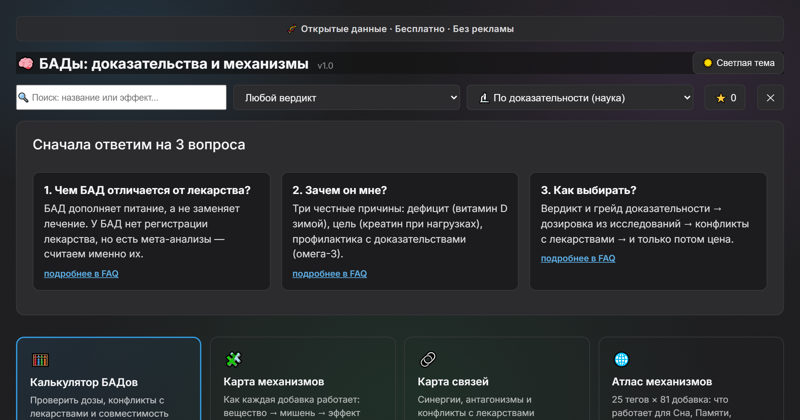

# БАДы: доказательства и механизмы

[](https://brain-25-evidence.streamlit.app)
[](https://deadsno.github.io/brain-25-evidence/)
[](https://github.com/DeadSno/brain-25-evidence/actions/workflows/tests.yml)

[](LICENSE)

Интерактивный дашборд и карта механизмов для 130 биологически активных добавок. Вердикты по мета-анализам PubMed, механизмы, атлас, карта связей, калькулятор доз, активные клинические испытания.

**🌐 Streamlit Live demo:** [brain-25-evidence.streamlit.app](https://brain-25-evidence.streamlit.app)

**📖 Статический сайт:** [Открыть сайт](https://deadsno.github.io/brain-25-evidence/) | [🧮 Калькулятор](https://deadsno.github.io/brain-25-evidence/calculator.html) | [Карта механизмов](https://deadsno.github.io/brain-25-evidence/map.html) | [Карта связей](https://deadsno.github.io/brain-25-evidence/interactions.html) | [Атлас](https://deadsno.github.io/brain-25-evidence/atlas.html) | [Задать вопрос](https://deadsno.github.io/brain-25-evidence/faq.html)



---

## 🎛️ Два интерфейса к одной базе

| Интерфейс | Для кого | Стек | Ссылка |
|-----------|----------|------|--------|
| **Streamlit dashboard** | Аналитики, исследователи — нужны фильтры и CSV | Python + pandas + Streamlit | [live](https://brain-25-evidence.streamlit.app) |
| **Статический сайт** | Читатели — вердикты, механизмы, дозы | HTML + JS + JSON, GitHub Pages | [live](https://deadsno.github.io/brain-25-evidence/) |

Streamlit — это витрина «сырых» данных: 37 618 papers из PubMed, фильтры по году/design/species/quartile, поиск, экспорт CSV, таблица добавок. Статический сайт — это выжатые выводы и ручная аналитика.

---

## 🎯 Аудит данных (сентябрь 2026)

130/130 добавки — полная ручная верификация по методологии PRISMA:

| Грейд | Значение | Количество |
|-------|----------|------------|
| A | работает отлично | 8 (6.2%) |
| B | работает | 45 (34.6%) |
| C | зависит от контекста | 52 (40.0%) |
| D | не подтверждено | 25 (19.2%) |

**Что сделано:**

- **Калькулятор БАДов** — вес/пол/возраст, UL-проверка, конфликты, синергии, 8 профилей
- **Q1.4**: adv-поля 130/130 (about, who_needs, onset, myths, food_sources, guidelines, how_to_choose)
- **Механизмы**: 130/130, среднее 3.01 на карточку
- **Hedges' g**: 86/130 (82 с CI), двухпроходный алгоритм без cross-matching
- **Аудиты q14 D1/D2**: 5 + 10 PMIDs заменены свежими, follow-up по 51 карточке
- **DOI**: 388/393 key_sources обогащены через PubMed esummary
- **audit_stale.py**: квартальный аудит PMIDs >5 лет (8 карточек без свежих МА — оставлены сознательно)
- **XSS-fix**: esc() во всех точках рендера (118 вызовов в 7 файлах + внутренние хелперы)
- **Производительность**: data_index.json (84 КБ против 732 КБ у data.json, ×8.7 легче)
- **Mobile**: адаптив всех страниц, H1 переносится, модалка fullscreen
- **Методология**: methodology.html
- **Архитектура**: ARCHITECTURE.md

## Оглавление

1. [Что это и зачем](#что-это-и-зачем)
2. [Быстрый старт](#быстрый-старт)
3. [Главные находки](#главные-находки)
4. [Методология](#методология)
5. [Данные](#данные)
6. [Структура репозитория](#структура-репозитория)
7. [Локальный запуск](#локальный-запуск)
8. [Roadmap](#roadmap)
9. [Как помочь проекту](#как-помочь-проекту)
10. [Дисклеймер и лицензия](#дисклеймер-и-лицензия)

## Что это и зачем

**Зачем этот проект:** рынок БАДов в России — это миллиарды рублей в год. Большинство покупок делается по рекламе и советам блогеров, но наука часто говорит противоположное: часть добавок работает только при дефиците, часть — только у пациентов, а часть — маркетинг без единого доказательства на людях.

**Что мы показываем для каждой из 130 добавок:**

| Что показываем | Зачем это знать | Источник |
|----------------|-----------------|----------|
| Индекс доказательности | Сколько науки стоит за добавкой | PubMed E-utilities |
| Вердикт (+1 / 0 / -1) | Работает / зависит / не подтверждено | Ручная вычитка топ-2 мета-анализов |
| Hedges' g | Сила эффекта в стандартных отклонениях | Из мета-анализов (86/130) |
| Активных испытаний | Тестирует ли кто-то сейчас | ClinicalTrials.gov |
| Дозировка и предостережения | Как принимать безопасно | Протоколы из исследований |
| Конфликты с лекарствами | Что нельзя совмещать | Interaction-база |

## Анализ конфликтов интересов (COI)

Проанализировано **6310 полных текстов** из PubMed Central. Всего XML
получено 7918, разобран текст с объёмом от 20 000 байт (порог
`threshold_bytes` в отчёте). Из 11 176 PMCID в наборе полных текстов
**56.5 %**.

> Прежняя формулировка «87 % покрытие PMCID» была неверной: 87.0 % — это
> доля полных текстов, в которых конфликт интересов **заявлен**, а не
> покрытие PMCID. Само покрытие PMCID равно 56.5 %.

| Метрика | Значение | % |
|---------|----------|---|
| Указали COI | 5490 | **87.0%** |
| — нет конфликта | 4349 | 68.9% |
| — **реальный конфликт** | **467** | **7.4%** |
| — неясно | 674 | 10.7% |
| Не указали COI | 820 | 13.0% |
| Указали funding | 3500 | 55.5% |
| Упомянули фарм-компанию | 282 | 4.5% |

Все проценты считаются от 6310, а не от 7918: сумма строк COI
(5490 + 820) даёт те же 6310, а строка «реальный конфликт» (467)
восстанавливается вычитанием 5490 − 4349 − 674.

**ТОП-10 funders** — государственные фонды: NSFC (Китай), NIH/NCI/NIDDK/NIA (США),
NCCAM, NIAAA, NICHD, NIGMS. **Ни одной фарм-компании в ТОП-10.**

📄 Полный отчёт: [`reports/coi_report.json`](reports/coi_report.json)

## Тестирование API (Postman)

Импортируйте готовую коллекцию для тестирования REST API:

1. Скачайте: [`docs/api/v1/postman_collection.json`](docs/api/v1/postman_collection.json)
2. Импортируйте в Postman (File → Import)
3. Импортируйте окружение: [`docs/api/v1/postman_environment.json`](docs/api/v1/postman_environment.json)
4. Запустите Collection Runner — 2 запроса, 16 проверок

**Что проверяется:**
- Статус 200, Content-Type
- Count = 130 карточек
- Обязательные поля (id, grade, verdict)
- Grades A/B/C/D, вердикты — из допустимых
- scienceIndex — число

## Быстрый старт

- **Хочешь посмотреть результаты?** Открой [сайт](https://deadsno.github.io/brain-25-evidence/) — фильтры, поиск, модалки, радар сравнения.
- **Хочешь работать с сырыми данными?** Открой [Streamlit dashboard](https://brain-25-evidence.streamlit.app) — фильтры по году / design / species / quartile, поиск, экспорт CSV.
- **Хочешь увидеть механизмы?** [Карта механизмов](https://deadsno.github.io/brain-25-evidence/map.html) — добавка → мишень в организме → эффект, с цветовой кодировкой доказательности.
- **Хочешь посчитать дозы?** [Калькулятор БАДов](https://deadsno.github.io/brain-25-evidence/calculator.html) — вес/пол/возраст, UL-проверка, конфликты по группам, 8 готовых профилей.
- **Хочешь поспорить с методологией?** Раздел [Методология](#методология) и issues.
- **Хочешь запустить у себя?** Раздел [Локальный запуск](#локальный-запуск).

## Главные находки

Распределение вердиктов по 8 крупным категориям. Пересчитано по
`docs/data.json` 2026-10-06: восемь групп покрывают **58 из 130** записей,
остальные 72 лежат в категориях вроде «Сердце», «Метаболизм», «Кости», —
поэтому сумма таблицы 58, а не 130.

### Корреляции (наука × интерес)

| Связь | Коэфф. | n | Вывод |
|-------|--------|---|-------|
| Wikipedia × Наука | +0.17 (Пирсон), +0.23 (Спирмен) | 90 | Просмотры статьи Википедии — плохой индикатор научности БАД: связь есть, но слабая и объясняется размером аудитории вещества |

> Прежняя запись «+0.01 при n = 41» повторно не воспроизводится: на текущих
> данных пар, где заполнены и `wiki`, и `scienceIndex`, — **90**, а не 41.
> Подмножество, дающее ровно 41, из данных не восстанавливается, поэтому
> число снято, а не пересчитано «по той же методике».

### Распределение по 8 категориям

| Категория | не подтверждено | зависит | работает | Всего | Комментарий |
|-----------|-----------------|---------|----------|-------|-------------|
| Спорт | 1 | 2 | 4 | 7 | Работают креатин, L-цитруллин, сывороточный протеин, HMB — эффект меряется секундами |
| Когниция | 4 | 8 | 3 | 15 | Самая большая группа и самая «грязная»: 4 пустышки |
| Сон | 0 | 3 | 1 | 4 | Работает в основном мелатонин |
| Иммунитет | 2 | 6 | 3 | 11 | Работают бузина, лактоферрин, астрагал |
| Настроение | 0 | 2 | 0 | 2 | Ни одного подтверждённого |
| Кожа и суставы | 1 | 2 | 1 | 4 | Работает MSM |
| Кишечник | 0 | 1 | 2 | 3 | Работают S. boulardii и LGG |
| Общее | 6 | 5 | 1 | 12 | Витамины — в основном по дефициту |

**Топ-5 рабочих** (вердикт «работает», таких 40 из 130): креатин, кофеин,
мелатонин, бакопа, L-теанин. Омега-3 сюда **не входит** — её вердикт
«зависит от контекста».

**Топ-5 пустышек** (вердикт «не подтверждено», таких 26 из 130): ежовик,
ГАБА, гинкго, глицин, 5-HTP. Ресвератрол и пикногенол в этот список
**не входят**: их вердикт — «зависит от контекста».

## Методология

**Зачем эта секция:** чтобы любой мог воспроизвести наши выводы или поспорить с ними. Всё прозрачно.

### Индекс науки

**Индекс = РКИ + 5 × мета-анализы**

Проверяемо: формула сходится **в 130 из 130** карточек `docs/data.json`
(`scienceIndex == rct + 5 × metaCount`), то есть это описание реального
кода расчёта, а не только формулировка.

**Как считаем:** PubMed-запрос (вещество) AND (конкретный исход) с отсечкой ветеринарии и промышленных работ. Мета-анализ весит в 5 раз больше РКИ, потому что объединяет множество исследований.

**Почему так, а не иначе:** индекс меряет *количество* науки, а не *силу* эффекта. Поэтому параллельно ставим ручной вердикт по топ-2 мета-анализам.

**Примечание:** индекс отражает объём всей литературы по веществу, включая инъекционные и лекарственные формы. Лидер по индексу — омега-3 (10 666 из 130), то есть её индекс нельзя читать как объём доказательств именно перорального приёма. Тот же перекос виден на гиалуроновой кислоте (4 100): её литература раздута исследованиями инъекций в колено при остеоартрите. Вердикт и дозировка на карточке учитывают именно пероральный приём как БАД.

### Вердикты (вручную, по топ-2 мета-анализам)

| Код | Значение | Когда ставим |
|-----|----------|--------------|
| +1 | работает | стабильный эффект у здоровых — мета-анализы показывают значимый эффект в общей популяции |
| 0 | зависит от контекста | работает при дефиците / у пациентов / в экстриме — эффект только в подгруппах (дефицит, спортсмены, пожилые) |
| -1 | не подтверждено | маркетинг без человеческих доказательств — нет мета-анализов, или они отрицательные, или только in vitro / на животных |

### Активные испытания

Источник: ClinicalTrials.gov API v2. Статусы RECRUITING, ACTIVE_NOT_RECRUITING, NOT_YET_RECRUITING. Ноль испытаний = «маркетинг без будущего»: наука либо всё сказала, либо не верит в эффект.

## Данные (сентябрь 2026) {#данные}

| Метрика | Значение |
|---------|----------|
| Добавок | 130 |
| Категорий | 79 в `data.json` (у 130 записей), сводятся к 36 группам по первому сегменту: когниция, общее, иммунитет, метаболизм, спорт, сердце, кости… Восемь «крупных» категорий (когниция, сон, спорт, иммунитет, настроение, кожа/суставы, кишечник, общее) покрывают 58 из 130 записей |
| Учёных работ учтено | **96 236** по 130 добавкам: сумма полей `rct` (80 144 РКИ) и `metaCount` (16 092 мета-анализа) в `data.json`. Прежнее «2000+» было занижено примерно в 48 раз |
| Активных испытаний | проверены все 130 добавок (число испытаний проставлено у 94 из 130, сумма 11 930) |
| Источники науки | PubMed E-utilities, OpenAlex, Wikipedia, ClinicalTrials.gov |

## Структура репозитория

```text
brain-25-evidence/
├── app.py                         # Streamlit dashboard (фильтры + CSV)
├── requirements.txt               # зависимости (streamlit, pandas, ...)
├── docs/                          # статический сайт (GitHub Pages)
│   ├── index.html                 # дашборд: фильтры, поиск, модалки, радар
│   ├── calculator.html            # калькулятор доз и конфликтов
│   ├── map.html                   # карта механизмов (130 узла + оверлей + кросс-связи)
│   ├── atlas.html                 # атлас: хабы тегов × 130 добавок
│   ├── interactions.html          # карта связей (синергии/конфликты)
│   ├── graph.html                 # граф 130 узлов / 1982 связи (данные + предрасчёт позиций)
│   ├── trends.html                # executive summary, scatter-матрица, категории
│   ├── methodology.html           # методология аудита (PRISMA, грейды)
│   ├── faq.html                   # частые вопросы
│   ├── glossary.html              # глоссарий терминов
│   ├── feedback.html / support.html / offline.html
│   ├── sup/                       # 130 карточек добавок + index.html (каталог), генерируются
│   ├── vendor/                    # вендоренные библиотеки: vis-network, chart.js, bootstrap
│   ├── api/v1/                    # REST API: supplements.json, openapi.yaml, схемы
│   ├── script.js / science2.js / tracker.js / share.js / pwa.js / version.js
│   ├── style.css                  # стили (+ мобильная адаптация)
│   ├── data.json                  # ГЕНЕРИРУЕТСЯ (не править руками)
│   ├── data_index.json            # лёгкая проекция для главной (84 КБ)
│   ├── dosage_parsed.json         # распарсенные дозы (94 из 130, остальные — fallback)
│   ├── pairs.json                 # 7 пар синергий
│   ├── profiles.json              # 8 профилей-пресетов
│   ├── interactions_graph.json    # граф связей
│   ├── sw.js                      # Service Worker (PWA)
│   └── og.png                     # превью для соцсетей
├── src/                           # переиспользуемые модули
│   ├── config.py                  # 130 добавок: PubMed-запросы, нормы
│   ├── content.py                 # категории, эффекты, протоколы, механизмы
│   ├── ct_terms.py                # id → поисковые термины ClinicalTrials.gov
│   └── wiki_map.py                # id → названия статей ru.wikipedia
├── scripts/                       # пайплайн и утилиты
│   ├── update_all.py              # 4 шага: metrics → science → hedges_g → DOIs
│   ├── build_sup.py               # генератор 130 sup-страниц + каталог (Jinja)
│   ├── build_index.py             # data.json → data_index.json
│   ├── fetch_metrics.py           # wiki / citations / ongoing
│   ├── recalc_science_index.py    # scienceIndex = RCT + 5×MA
│   ├── fetch_hedges_g.py          # двухпроходный алгоритм g
│   ├── enrich_dois.py             # DOI в key_sources
│   ├── audit_stale.py             # квартальный аудит PMIDs >5 лет
│   ├── make_og.py                 # генерация og.png
│   ├── build_slim.py              # slim JSON для Streamlit Cloud
│   └── e2e_smoke.py               # headless smoke-тесты сайта
├── templates/                     # Jinja-шаблоны генерации sup/*.html и каталога
├── tests/                         # 989 тестов в 45 файлах
│   ├── test_schema.py             # JSON-схема data.json
│   ├── test_snapshot.py           # data.json не изменился без UPDATE_SNAPSHOT=1
│   ├── test_index_sync.py         # data_index.json == проекция data.json
│   ├── test_js_syntax.py          # node --check для script.js
│   └── ... (ещё 30+ файлов)
├── data/
│   ├── raw/                       # сырьё: PubMed, OpenAlex, Wiki
│   └── processed/                 # производные
├── reports/                       # логи запусков, отчёты
├── .github/workflows/
│   ├── tests.yml                  # pytest + node --check на push
│   ├── sync_version.yml           # автозаполнение version.json.tests
│   └── watchdog.yml               # недельная проверка links + schema
├── ARCHITECTURE.md
├── CONTRIBUTING.md
├── DATA_SOURCES.md
├── CHANGELOG.md
├── ROADMAP.md
└── serve.py                       # локальный HTTP-сервер (root)
```

## Локальный запуск

### Статический сайт (docs/)

```bash
# 1. Клонируй
git clone https://github.com/DeadSno/brain-25-evidence.git
cd brain-25-evidence

# 2. Установи зависимости
pip install -r requirements.txt

# 3. Прогони тесты (должно быть 790 passed, 2 skipped)
python -m pytest tests/ -q

# 4. Подними сайт локально
python serve.py
# → http://localhost:8000/
```

**Важно для headless-проверок:**

- Используй `http://localhost:8000`, **НЕ** `file://` — `fetch()` не работает в файловом протоколе (CORS)
- После старта сервера: `Ctrl+Shift+R` в браузере для обхода кэша `data.json`
- На GitHub Pages (https) `fetch` работает без проблем
- `serve.py` лежит в **корне** репозитория (не в `docs/`) и автоматически добавляет заголовки `Content-Type: text/html; charset=utf-8` (и для JS/CSS/JSON) — лечит локальные кракозябры
- Прогон `pytest -q` без живого сервера **проводит не все тесты**: 197 из 989 требуют браузера и сняты по умолчанию. Считать «зелёный прогон» доказательством того, что браузерные сценарии живы, нельзя

### Streamlit dashboard (app.py)

```bash
# Локально
pip install streamlit pandas
streamlit run app.py
# → http://localhost:8501

# Деплой
# 1. https://share.streamlit.io → New app
# 2. Repo: DeadSno/brain-25-evidence, Branch: main, Main file: app.py
# 3. Deploy → получаешь https://brain-25-evidence.streamlit.app
```

## Статус релиза

| | |
|---|---|
| **Версия** | **v5.6.1** — актуальная версия (`docs/version.json`: `app: 5.6.1`, запись в `CHANGELOG.md`). Git-тег не поставлен — решение владельца |
| **Дата данных** | **2026-09-25** (`docs/version.json`), последняя карточка обновлена 2026-09-25 |
| **Карточек** | **130** (100 % ручной верификации по PRISMA) |
| **Тестов** | **989** собрано (`pytest --collect-only -q`); быстрый гейт `pytest -q`: 790 passed, 2 skipped. Полный набор собирает 989, из них 197 требуют браузера и живого сервера и сняты по умолчанию флагами `RUN_SNAPSHOTS` / `RUN_A11Y` / `RUN_TABS` / `RUN_GRAPH` / `RUN_E2E` |
| **Страниц** | **14** в корне `docs/` + **131** в `docs/sup/` (130 карточек + каталог). В `sitemap.xml` — **143**: 12 индексируемых корневых + 131 в `sup/`. Не индексируются `offline.html` (офлайн-заглушка сервис-воркера) и `google*.html` (файл верификации GSC) |
| **Публикаций** | **37 618** из PubMed, из них с абстрактом — 35 377 |
| **Тегов эффектов** | 18 нормализованных |
| **PWA** | офлайн-режим, установка на телефон |
| **Лицензия** | Код — MIT. Данные — лицензии источников, см. `DATA_SOURCES.md`. **Фактически используются:** PubMed (ToS NCBI), OpenAlex CC0, Wikipedia CC BY-SA 3.0, ClinicalTrials.gov public domain (US Gov). **Запланирован, но данных нет:** SCImago Journal Rank (CC BY-NC) — в репозитории нет ни одного артефакта SCImago, только скрипты `fetch_scimago.py` и `join_scimago.py`; ни квартилей, ни журналов в `data.json` нет, поэтому лицензия SCImago на текущие данные не распространяется |

**Ссылки:**

| Что | Где |
|---|---|
| Статический сайт | <https://deadsno.github.io/brain-25-evidence/> |
| BI (отдельное приложение) | <https://brain-25-evidence.streamlit.app> |
| API | <https://deadsno.github.io/brain-25-evidence/api/v1/supplements.json> |
| Репозиторий | <https://github.com/DeadSno/brain-25-evidence> |
| Ошибки в данных | [issue `data-error`](.github/ISSUE_TEMPLATE/data-error.md) |
| Sitemap | <https://deadsno.github.io/brain-25-evidence/sitemap.xml> (143 URL, генерируется `scripts/build_sitemap.py`) |

Подробности изменений — в [CHANGELOG.md](CHANGELOG.md).

---

## Roadmap

### Текущее состояние

- 130 добавок, 989 тестов, 37 618 papers
- Funders analysis (CrossRef + Europe PMC)
- Streamlit BI + статический сайт
- trends.html: executive summary, scatter-матрица, категории

### Дальше

- Досчитать Hedges' g для оставшихся карточек
- Расширить базу до 150 добавок
- Публичный API (`docs/api/v1/supplements.json`)
- DWH на DuckDB + dbt

Полный план — [ROADMAP.md](ROADMAP.md).

## Как помочь проекту

### Нашли ошибку в данных?

Создайте [issue](https://github.com/DeadSno/brain-25-evidence/issues) по шаблону — исправим и отметим в CHANGELOG.

### Хотите добавить добавку?

1. Форкните репозиторий
2. Дополните `src/config.py` (запросы, нормы) и `src/content.py` (категории, эффекты, протоколы)
3. Прогоните `python scripts/update_all.py --apply` для регенерации `data.json`
4. Прогоните `python scripts/build_index.py` для синхронизации `data_index.json`
5. Откройте PR в `main`

Полные правила — в [CONTRIBUTING.md](CONTRIBUTING.md).

### Просто поддержать

Звёздочка на GitHub и ссылка друзьям — уже помощь.

## Документация

- [ARCHITECTURE.md](ARCHITECTURE.md) — как устроен проект: PubMed → data.json → HTML
- [CONTRIBUTING.md](CONTRIBUTING.md) — как внести вклад: правила данных, PR-процесс
- [DATA_SOURCES.md](DATA_SOURCES.md) — откуда данные, лицензии, как воспроизвести
- [CHANGELOG.md](CHANGELOG.md) — история версий
- [ROADMAP.md](ROADMAP.md) — планы
- [methodology.html](https://deadsno.github.io/brain-25-evidence/methodology.html) — методология расчёта индекса и грейдов

## Дисклеймер и лицензия

### Дисклеймер

**Проект не является медицинской рекомендацией.**

- При болезнях, беременности и приёме лекарств — сначала к врачу
- Дефицит определяется анализом крови, а не самочувствием и не этим сайтом
- Вердикт «+1» не значит «пейте всем», а «-1» не значит «опасно»

### Лицензия

MIT — используйте данные как угодно, указывайте источник.

### Источники данных

| Данные | Источник |
|--------|----------|
| РКИ и мета-анализы | PubMed E-utilities |
| Цитирования | OpenAlex |
| Просмотры | Wikipedia REST API |
| Активные испытания | ClinicalTrials.gov API v2 |

---

*Сделано с любопытством к доказательной медицине. 2026.*

© 2026 Vladislav "DeadSno" Pereshivalov · [Открытые данные без медицинских рекомендаций](https://deadsno.github.io/brain-25-evidence/) (манифест проекта).
