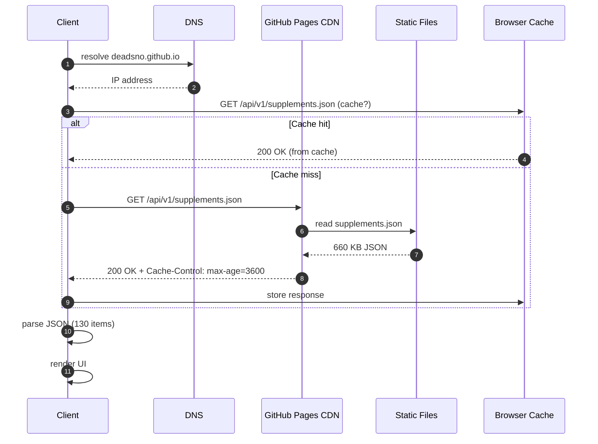
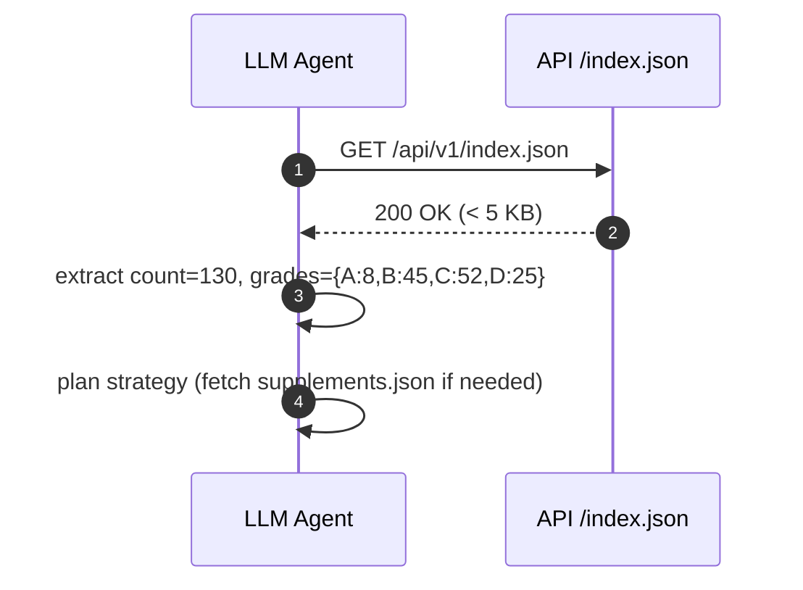
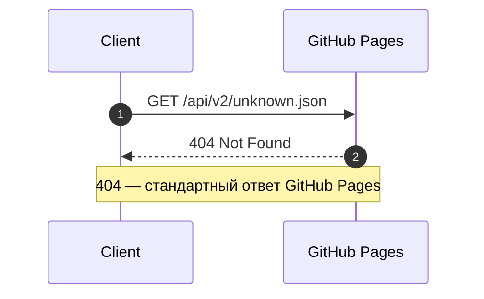

# API Sequence Diagram — взаимодействие клиента с API

> Sequence-диаграммы основных сценариев работы с REST API.
> Дополняет [OpenAPI spec](openapi.yaml) и [Error Contract](errors.md).

## 1. Успешный запрос — список добавок

## 2. Метаданные — index.json (лёгкий запрос)

## 3. Ошибка — endpoint не существует

## Сценарии и их характеристики

| # | Сценарий | Endpoint | Latency (p50) | Размер | Кэш |
|---|----------|----------|:-------------:|:------:|:---:|
| 1 | Список добавок (cache miss) | /supplements.json | ~300 ms | 660 KB | 1 час |
| 2 | Список добавок (cache hit) | — | < 10 ms | 0 B | — |
| 3 | Метаданные | /index.json | ~150 ms | 3 KB | 1 час |
| 4 | 404 | любой неверный | ~100 ms | ~1 KB | — |

## Связанные документы

- [OpenAPI 3.0 spec](openapi.yaml) — формальная спецификация
- [Error Contract](errors.md) — все возможные ошибки
- [Postman Collection](postman_collection.json) — рабочие примеры

## Версия

- v1.0 — 2026-09-26, 4 сценария, 3 диаграммы
