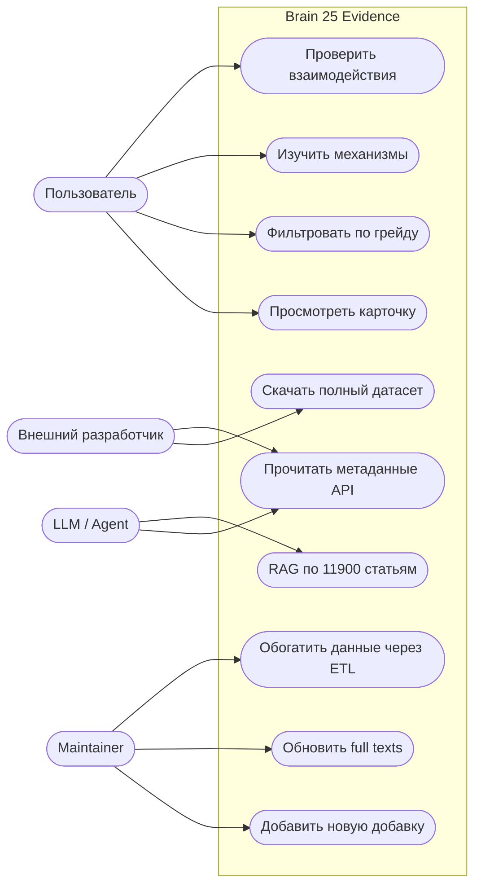
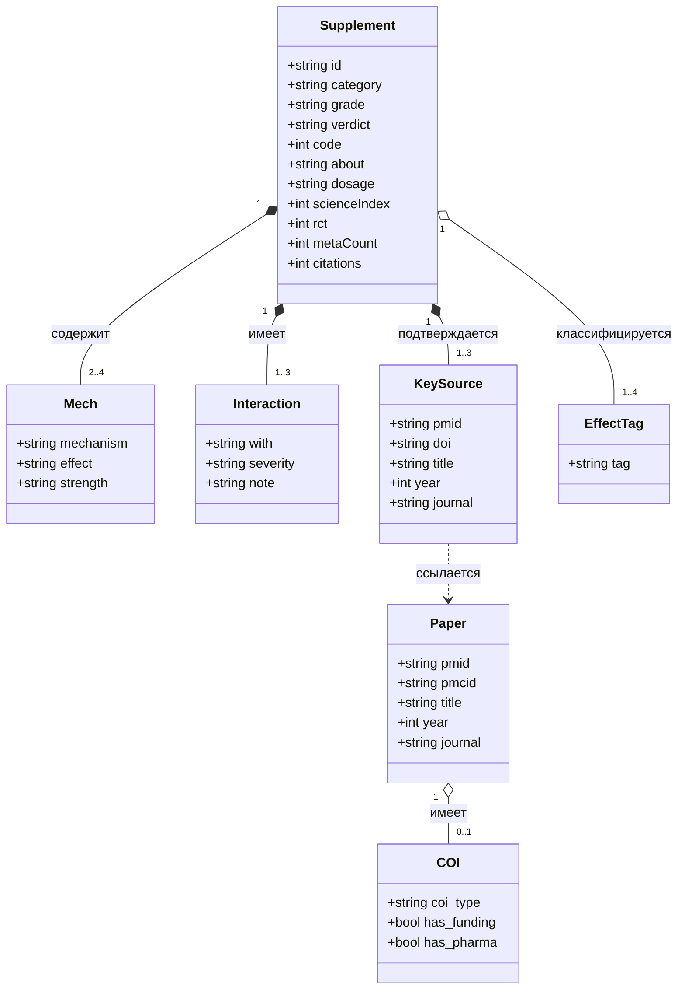
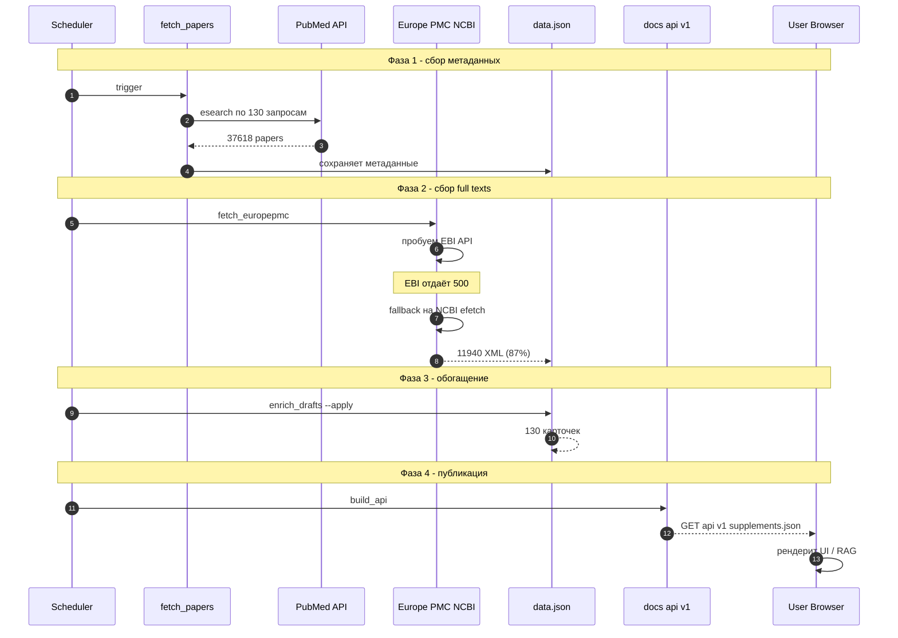
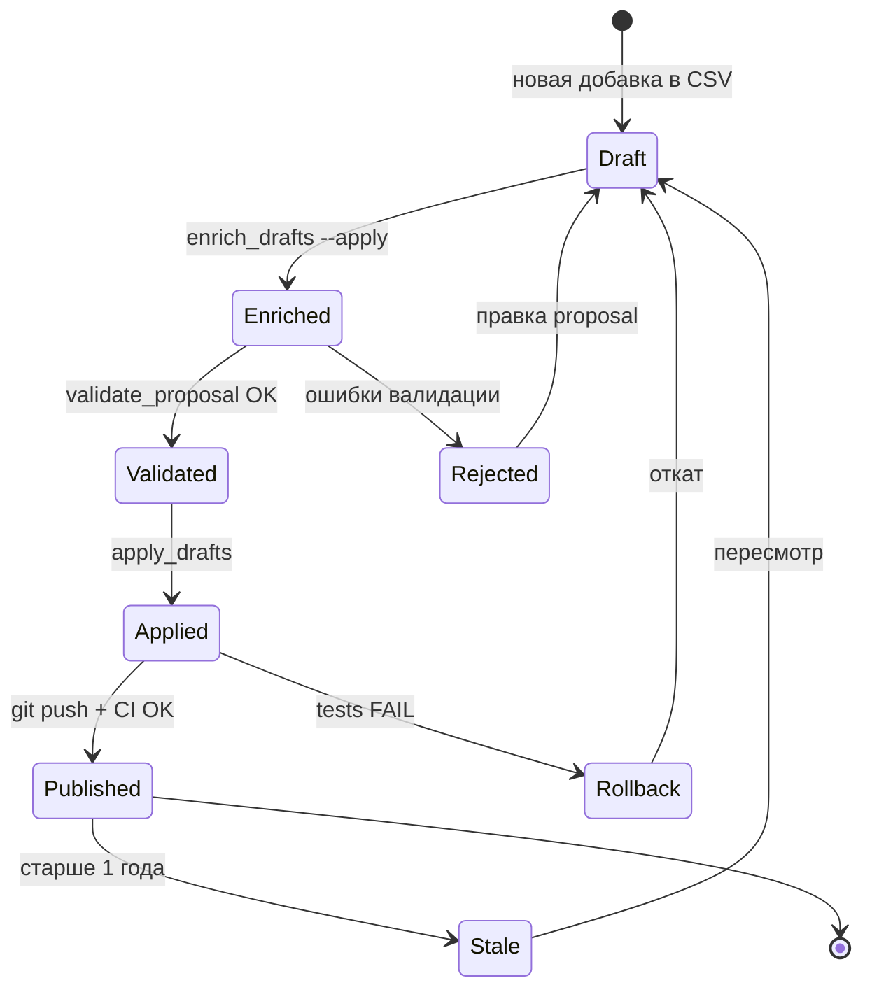
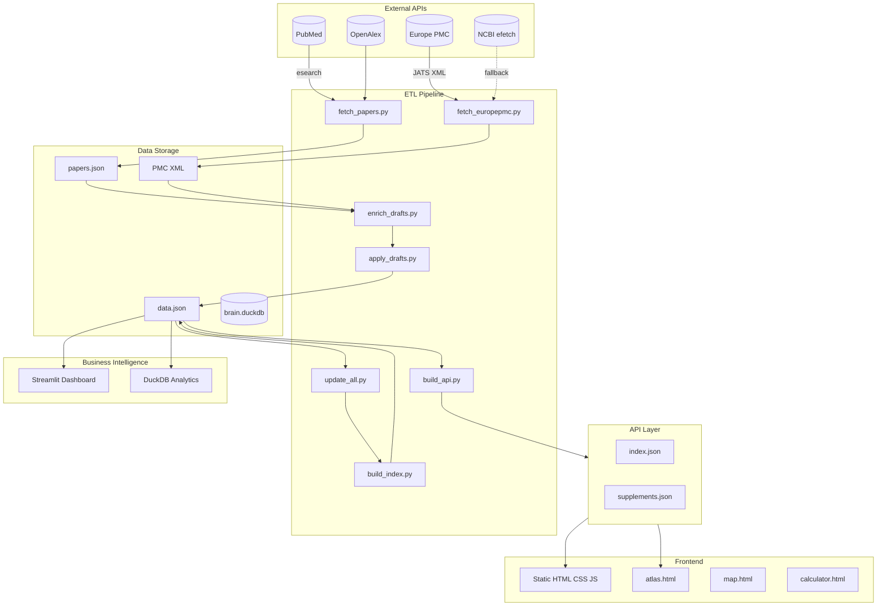

# Архитектурные диаграммы

> Формальные UML-диаграммы проекта. Рендерятся автоматически на GitHub через Mermaid.
> Основной контекст — [ARCHITECTURE.md](../ARCHITECTURE.md).

Содержание:
1. [Use Case Diagram](#1-use-case-diagram--кто-и-что-делает-с-системой)
2. [Class Diagram](#2-class-diagram--модель-данных)
3. [Sequence Diagram](#3-sequence-diagram--etl-pipeline)
4. [State Machine](#4-state-machine--жизненный-цикл-добавки)
5. [Component Diagram](#5-component-diagram--компоненты-системы)

## 1. Use Case Diagram — кто и что делает с системой

### Акторы

| Актор | Роль | Use Cases |
|-------|------|-----------|
| Пользователь | Конечный потребитель | UC1-UC4 |
| Внешний разработчик | Интегратор API | UC5-UC6 |
| Maintainer | Владелец проекта | UC7-UC9 |
| LLM / Agent | RAG-система | UC6, UC10 |

## 2. Class Diagram — модель данных

## 3. Sequence Diagram — ETL pipeline

## 4. State Machine — жизненный цикл добавки

### Статусы и переходы

| Статус | Описание | Условие входа | Выход |
|--------|----------|---------------|-------|
| Draft | Черновик в _drafts.json | Добавлен в CSV | Enriched / Rejected |
| Enriched | Заполнены adv-поля | enrich_drafts --apply | Validated / Rejected |
| Validated | Прошёл validate_proposal | 0 errors | Applied |
| Rejected | Ошибки валидации | Есть errors | Draft (правка) |
| Applied | Смерджен в data.json | apply_drafts OK | Published / Rollback |
| Published | В production | git push + CI | Stale |
| Rollback | Откат из-за ошибок | tests FAIL | Draft |
| Stale | Не обновлялся > 1 года | Время | Draft |

## 5. Component Diagram — компоненты системы

### Принципы архитектуры

- **Backend-less:** нет серверной логики — только статика
- **Idempotent ETL:** повторный запуск не ломает данные
- **Git as database:** вся история в git
- **Fallback chains:** EBI -> NCBI, JSON -> DuckDB
- **Separation of Concerns:** данные, логика, представление разделены

## Версия

- v1.2 — 2026-09-25, 5 диаграмм, batch 17c, 130 добавок
