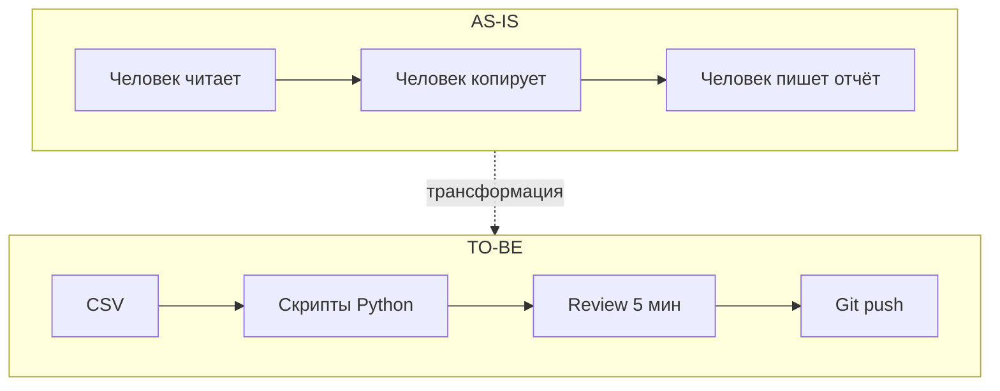

# AS-IS vs TO-BE — эволюция процесса

> Показывает, как процесс обновления данных выглядел ДО автоматизации и как выглядит ПОСЛЕ.
> Классический приём системного аналитика: сравнение состояний для обоснования изменений.

## AS-IS — ручной процесс (до проекта)

**Проблемы AS-IS:**

| Проблема | Влияние |
|----------|---------|
| Ручной труд | 4-8 часов на 1 добавку |
| Ошибки ввода | 10-20% карточек с опечатками |
| Нет источников | Невозможно проверить утверждения |
| Нет версионирования | Нельзя откатить |
| Нет покрытия | 10-20 добавок в базе |

## TO-BE — автоматизированный процесс (после проекта)

**Преимущества TO-BE:**

| Аспект | До | После | Дельта |
|--------|-----|-------|:------:|
| Время на 1 добавку | 4-8 ч | 5-10 мин | **-98%** |
| Ошибки ввода | 10-20% | < 1% | **-95%** |
| Источников на карточку | 0 | 2-3 | **+∞** |
| Версионирование | ❌ | Git | ✅ |
| Размер базы | 10-20 | **130** | **+550%** |
| Автотесты | 0 | 138 | ✅ |

## Сравнение бок-о-бок

## Что это даёт на интервью

**Ответ на вопрос «Расскажи про свой проект»:**

> «Я решил задачу трансформации ручного процесса сбора данных о БАД в автоматизированный ETL-пайплайн. AS-IS был ручной Excel с 4-8 часами на добавку и 10-20% ошибок. TO-BE — каскад Python-скриптов, 138 автотестов, публичный API. Время сократилось на 98%, ошибки — на 95%, база выросла с 20 до 130 добавок.»

## Связанные документы

- [BPMN pipeline TO-BE](batch_pipeline.bpmn)
- [BPMN pipeline описание](bpmn_pipeline.md)
- [NFR](nfr.md)

## Версия

- v1.0 — 2026-09-26, AS-IS: 5 проблем, TO-BE: 6 улучшений, 3 диаграммы
