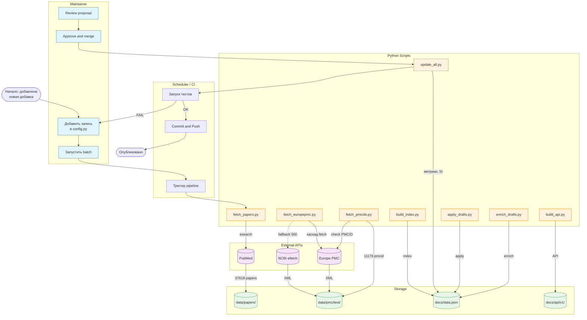
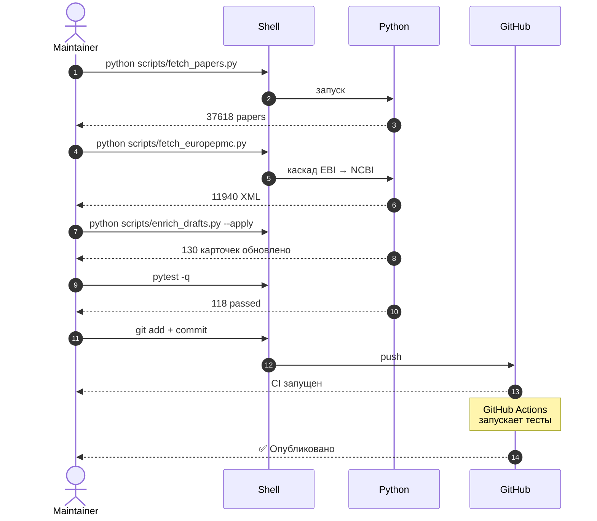

# BPMN — бизнес-процессы проекта

> Формальные схемы бизнес-процессов в нотации BPMN 2.0.
> Рендерятся через Mermaid на GitHub.
> Основной контекст — [ARCHITECTURE.md](../ARCHITECTURE.md).

## Файлы

- **Camunda Modeler:** [`docs/bpmn/batch_pipeline.bpmn`](bpmn/batch_pipeline.bpmn) — открывается в Camunda Modeler
- **Скриншот:** [`docs/bpmn/screenshot.png`](bpmn/screenshot.png) — цветная схема из Camunda Modeler (2x)

## 1. Основной pipeline — от метаданных до публикации

## 2. Ручное обновление (без CI) — резервный сценарий

## Матрица RACI

| Задача | Maintainer | Scheduler | Python | APIs | Storage |
|--------|:----------:|:---------:|:------:|:----:|:-------:|
| Добавить добавку | **R** | I | C | — | — |
| Fetch метаданных | I | **R** | E | C | W |
| Fetch full texts | I | **R** | E | C | W |
| Обогащение карточек | **A** | R | E | — | W |
| Review proposal | **R** | I | — | — | — |
| Публикация API | I | **R** | E | — | W |
| Тесты | I | **R** | E | — | — |

**Легенда:** R — Responsible (делает), A — Accountable (отвечает), C — Consulted, I — Informed, E — Executes, W — Writes.

## События и шлюзы

| Событие | Тип | Действие |
|---------|-----|----------|
| `Новая добавка` | Start | Триггер batch |
| `Тесты FAIL` | Error | Возврат к Review |
| `EBI 500` | Escalation | Fallback на NCBI |
| `Публикация` | End | GitHub Pages rebuild |
| `Сброс failed → pending` | Timer | Ручной перезапуск fetch |

## Версия

- v1.0 — 2026-09-25, batch 17c, 130 добавок, 11940 full texts