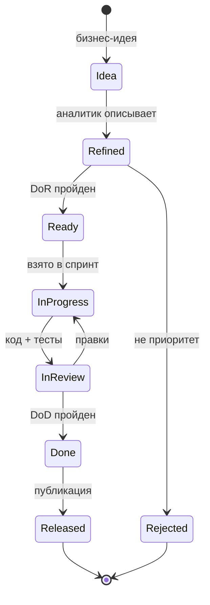

# Definition of Ready (DoR)

> Критерии готовности User Story к работе. Пока задача не соответствует DoR — её нельзя брать в спринт.
> Дополняет [Definition of Done](https://github.com/DeadSno/brain-25-evidence/blob/main/docs/user_stories.md).

## Чек-лист DoR для User Story

**Обязательные:**

- [ ] Есть ID (US-XX)
- [ ] Формат «Как [роль], я хочу [действие], чтобы [ценность]»
- [ ] Минимум 3 Acceptance Criteria в формате проверяемых утверждений
- [ ] Приоритет (Must / Should / Could / Won't)
- [ ] Эстимация в Story Points
- [ ] Указан эпик (UI / API / Maintainer)
- [ ] Есть ссылка на дизайн-артефакт (OpenAPI, mockup, диаграмма)

**Желательные:**

- [ ] Gherkin-сценарий (Given/When/Then)
- [ ] Ссылка на похожую реализованную US
- [ ] Указаны зависимости (blocked by)
- [ ] Определены НФТ (если есть особые требования)

## Чек-лист DoR для задачи (Task)

- [ ] Ссылка на US-родителя
- [ ] Оценка в часах (< 8 часов, иначе декомпозиция)
- [ ] Явно определён результат (что должно появиться после)
- [ ] Указан исполнитель (Assignnee)
- [ ] Нет блокирующих зависимостей

## Пример: US-05 соответствует DoR

**US-05. Получить список добавок**

- ✅ ID: US-05
- ✅ Формат: «Как внешний разработчик, я хочу получить полный датасет в JSON, чтобы построить свой сервис»
- ✅ AC: 4 критерия (status 200, OpenAPI соответствие, Content-Type, кэш)
- ✅ Приоритет: Must have
- ✅ Эстимация: 2 SP
- ✅ Эпик: API
- ✅ Дизайн: `docs/api/v1/openapi.yaml`
- ✅ Gherkin: «Scenario: Получить все добавки»

**Готова к работе.**

## Пример: US-07 НЕ соответствует DoR

**US-07. Фильтрация на сервере**

- ✅ ID: US-07
- ✅ Формат: «Как разработчик, я хочу фильтровать через query-параметры...»
- ✅ AC: 4 критерия
- ✅ Приоритет: Should have (v2)
- ✅ Эстимация: 5 SP
- ⚠️ Эпик: API (v2)
- ❌ Дизайн: **нет финального дизайна query-параметров**
- ❌ Зависимость: **нужен backend (сейчас только статика)**

**НЕ готова — отложена в v2 до решения по backend.**

## Жизненный цикл User Story

## Метрики DoR

| Метрика | Целевое | Текущее |
|---------|:-------:|:-------:|
| % US, соответствующих DoR | 100% | 8 из 9 (89%) |
| Средняя эстимация | < 5 SP | 3.7 SP |
| US без AC | 0 | 0 |
| US без приоритета | 0 | 0 |

**Не соответствует DoR:** US-07 (требует backend).

## Связанные документы

- [User Stories](user_stories.md)
- [RTM](rtm.md)
- [Gherkin](gherkin.md)
- [Impact Analysis](impact_analysis.md)

## Версия

- v1.0 — 2026-09-26, 7 обязательных + 4 желательных критерия
