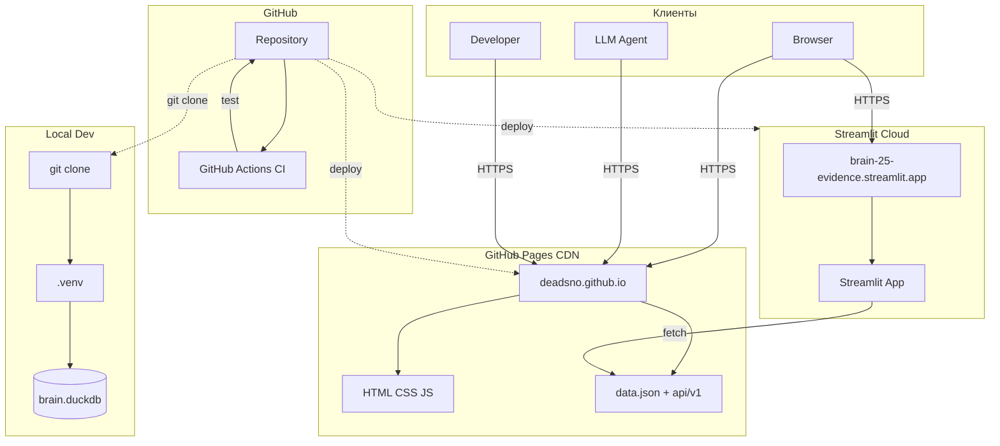
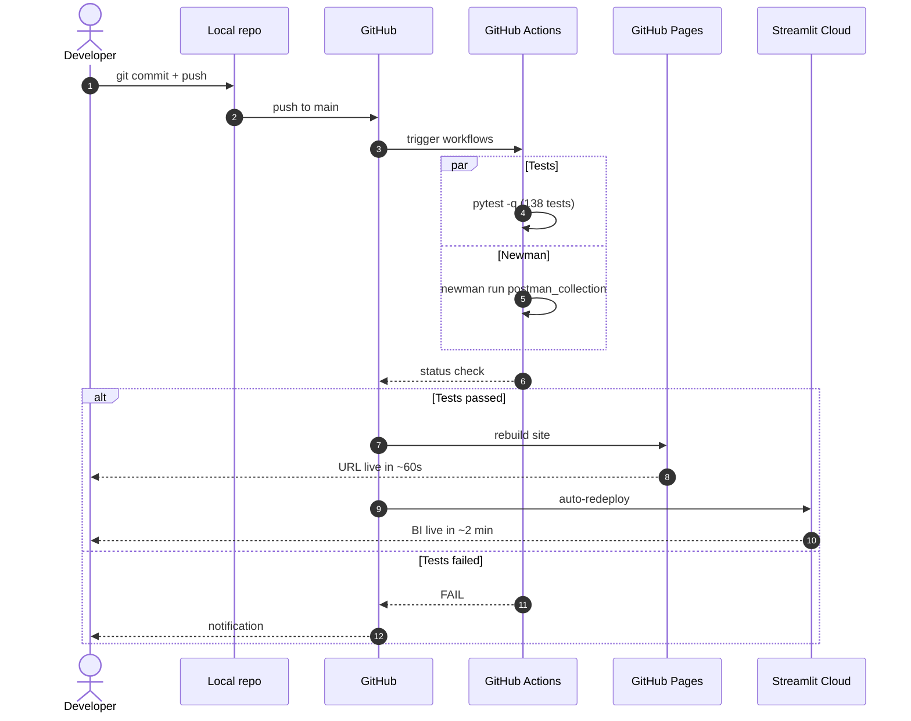

# Deployment — как система развёрнута

> Инфраструктурная схема проекта: где живут данные, сервисы и клиенты.
> Дополняет [Component Diagram](architecture_diagrams.md) техническим развёртыванием.

## Общая схема



## Компоненты развёртывания

| Компонент | Хостинг | URL | Стоимость |
|-----------|---------|-----|-----------|
| Статический сайт | GitHub Pages | https://deadsno.github.io/brain-25-evidence/ | 0 руб |
| BI Dashboard | Streamlit Cloud | https://brain-25-evidence.streamlit.app | 0 руб |
| API | GitHub Pages (static) | /api/v1/*.json | 0 руб |
| CI | GitHub Actions | — | 0 руб |
| Репозиторий | GitHub | https://github.com/DeadSno/brain-25-evidence | 0 руб |
| Локальная разработка | Developer machine | — | — |

**Итого: 0 руб/мес.**

## Пайплайн деплоя



## Уровни развёртывания

### Production

- Статика — GitHub Pages, CDN, HTTPS, custom domain
- BI — Streamlit Cloud
- API — статические JSON-файлы (нет backend)
- SLA — 99.9%

### Staging / Preview

- Не требуется — GitHub Pages деплоит только main
- Альтернатива: локальный запуск через:

```bash
python -m http.server 8000 --directory docs
```

### Local Development

```bash
git clone https://github.com/DeadSno/brain-25-evidence
cd brain-25-evidence
python -m venv .venv
.venv/Scripts/activate
pip install -r requirements.txt
python -m http.server 8000 --directory docs
# открыть http://localhost:8000
```

## Переменные окружения

| Переменная | Где | Назначение |
|-----------|-----|-----------|
| UPDATE_SNAPSHOT | Локально | Обновить snapshot-тесты |
| EMAIL | Скрипты fetch | User-Agent для PubMed/NCBI |
| TOOL | Скрипты fetch | Идентификация в API-запросах |

**Секретов нет** — API публичные, GitHub Pages не требует auth.

## Disaster Recovery

| Сценарий | Что происходит | Recovery |
|----------|----------------|----------|
| GitHub Pages упал | Сайт недоступен | Ждать восстановления GitHub |
| Streamlit Cloud упал | BI недоступен | Fallback на GitHub Pages |
| PubMed API упал | fetch падает | Retry 3x с backoff |
| EBI отдаёт 500 | fetch не работает | Автоматический fallback на NCBI |
| Локально git сломан | Нельзя коммитить | git reset --hard origin/main |

## Мониторинг

| Что | Как | Кто |
|-----|-----|-----|
| CI статус | GitHub Actions badge | Developer |
| Newman (API) | Scheduled workflow (weekly) | Developer |
| Snapshot-тесты | pytest при каждом push | CI |
| Availability | Ручной UptimeRobot (опционально) | Developer |

## Связанные документы

- [Component Diagram](architecture_diagrams.md)
- [NFR — Доступность](nfr.md)
- [BPMN pipeline](bpmn_pipeline.md)
- [ADR-002: GitHub Pages](adr/002-github-pages.md)

## Версия

- v1.0 — 2026-09-26, 6 компонентов, 0 руб/мес
