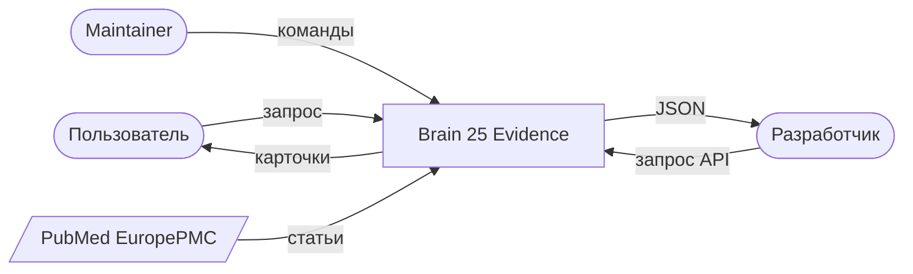
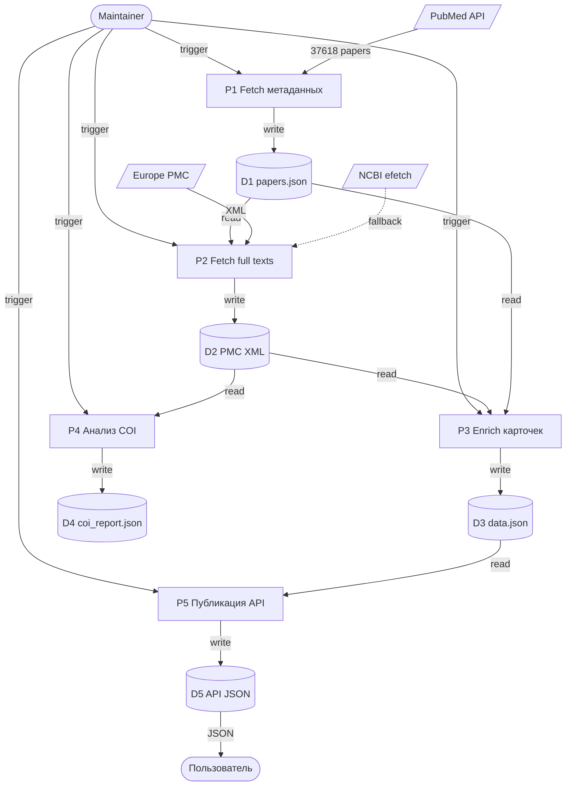
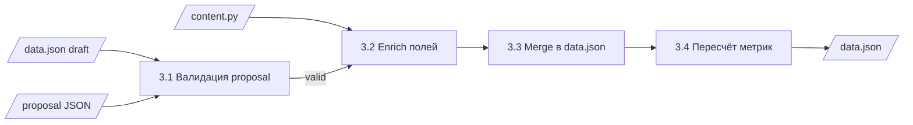

# DFD — Data Flow Diagram

> Диаграмма потоков данных (нотация Yourdon/DeMarco).
> Показывает, как данные перемещаются между процессами, хранилищами и внешними системами.
>
> Дополняет [BPMN](bpmn_pipeline.md) (процессы) и [ERD](erd.md) (данные в покое).

## Уровень 0 — Контекстная диаграмма

## Уровень 1 — Основные процессы

## Уровень 2 — Процесс P3 (Enrich)

## Потоки данных — таблица

| # | Источник | Приёмник | Данные | Формат | Частота |
|---|----------|----------|--------|--------|---------|
| F1 | Maintainer | P1 | Триггер | CLI | вручную |
| F2 | PubMed API | P1 | 37 618 papers | JSON | раз в месяц |
| F3 | P1 | D1 | papers.json | JSON | после P1 |
| F4 | Europe PMC | P2 | XML | HTTP | по запросу |
| F5 | NCBI | P2 | XML (fallback) | HTTP | по запросу |
| F6 | P2 | D2 | 11 940 XML | files | после P2 |
| F7 | D2 + D1 | P3 | Full texts + metadata | mix | при обновлении |
| F8 | P3 | D3 | data.json | JSON | после enrich |
| F9 | D2 | P4 | XML для анализа | files | раз в месяц |
| F10 | D3 | P5 | data.json | JSON | при публикации |
| F11 | P5 | D5 | API JSON | JSON | при публикации |
| F12 | D5 | User | JSON | HTTP | real-time |

## Хранилища данных

| ID | Путь | Содержимое | Размер | Формат |
|----|------|-----------|--------|--------|
| D1 | data/papers/papers.json | Метаданные 37 618 статей | ~50 MB | JSON |
| D2 | data/pmc/text/*.xml | 11 940 full texts | ~1 GB | XML |
| D3 | docs/data.json | 130 карточек (истина) | 76 KB | JSON |
| D4 | reports/coi_report.json | Анализ COI | 50 KB | JSON |
| D5 | docs/api/v1/*.json | API endpoints | 660 KB | JSON |
| D6 | data/db/brain.duckdb | Аналитическая БД | ~30 MB | DuckDB |

## Внешние сущности

| Сущность | Тип | Протокол | Формат | SLA |
|----------|-----|----------|--------|-----|
| PubMed | API | HTTPS | XML | best effort |
| Europe PMC | REST | HTTPS | XML | best effort |
| NCBI efetch | REST | HTTPS | XML | best effort |
| OpenAlex | API | HTTPS | JSON | best effort |
| GitHub Pages | CDN | HTTPS | HTML/JSON | 99.9% |

## Уровни декомпозиции

| Уровень | Что показывает | Аудитория |
|---------|----------------|-----------|
| 0 | Внешние взаимодействия | Бизнес, аналитики |
| 1 | Основные процессы + хранилища | Разработчики, СА |
| 2 | Детализация подпроцесса | Разработчики |

## Версия

- v1.0 — 2026-09-25, 5 процессов, 6 хранилищ, 12 потоков
