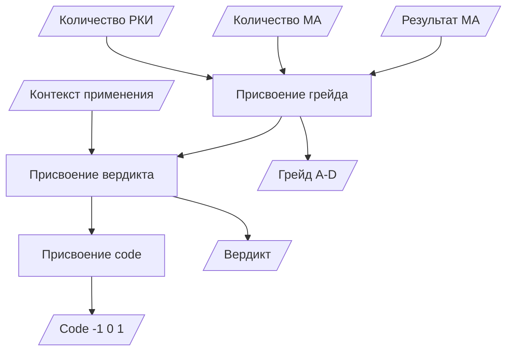

# DMN — Decision Model and Notation

> Модель бизнес-правил присвоения грейдов доказательности БАД.
> Формат: [OMG DMN 1.5](https://www.omg.org/spec/DMN/).
>
> Связанные документы:
> - User Stories: [user_stories.md](user_stories.md)
> - SRS: [srs.md](srs.md)
> - Методология: [methodology.html](methodology.html)

## 1. Контекст решения

**Вопрос:** Какой грейд доказательности присвоить добавке?

**Кто принимает:** Системный аналитик (вручную) + автоматическая валидация.

**Входные данные:**
- Количество РКИ (`rct`)
- Количество мета-анализов (`meta_count`)
- Science Index (`science_index`)
- Результаты MA (эффект есть / нет)

**Выход:** Грейд A / B / C / D + вердикт + code.

## 2. Decision Requirements Diagram (DRD)



## 3. Decision Table — Присвоение грейда

| # | RCT | MA | Эффект в MA | Контекст | Грейд | Пример |
|---|-----|-----|-------------|----------|:-----:|--------|
| R1 | > 100 | > 10 | Положительный у здоровых | — | **A** | Витамин D, Кофеин |
| R2 | > 50 | > 5 | Положительный с оговорками | — | **B** | Омега-3, Магний |
| R3 | 10-50 | 1-5 | Только в подгруппах | Дефицит, болезнь | **C** | Селен (HSAN1), Серин |
| R4 | < 10 | 0-1 | Не изучался или отрицательный | — | **D** | PABA, Пролин, Бор |

### Детализация по правилам

**R1 — Grade A:**
- RCT > 100, MA > 10
- Эффект подтверждён в MA на здоровых
- Нет конфликта результатов в MA
- **Пример:** Витамин D — 4007 RCT, 999 MA

**R2 — Grade B:**
- RCT 50-100 или MA 5-10
- ИЛИ эффект есть, но CI широкий
- ИЛИ есть разные MA (положительные и нейтральные)
- **Пример:** Омега-3 — 4751 RCT, 1008 MA, но эффект контекстный

**R3 — Grade C:**
- RCT 10-50 или MA 1-5
- Эффект только при дефиците / в редких подгруппах
- **Пример:** Серин — RCT 2 (HSAN1), MA 0, но эффект в узкой подгруппе

**R4 — Grade D:**
- RCT < 10, MA = 0
- ИЛИ все MA отрицательные
- ИЛИ исследования только на животных
- **Пример:** PABA — 1 RCT (отрицательный), 0 MA

## 4. Decision Table — Присвоение вердикта

| # | Грейд | Контекст | Вердикт | Code |
|---|:-----:|----------|---------|:----:|
| V1 | A | Эффект у здоровых | работает | 1 |
| V2 | B | Эффект с оговорками | работает | 1 |
| V3 | C | Только при дефиците | зависит от контекста | 0 |
| V4 | C | Только в редких диагнозах | зависит от контекста | 0 |
| V5 | D | Нет MA / отрицательные | не подтверждено | -1 |

## 5. FEEL-выражения (для Camunda DMN engine)

Если DMN будет обрабатываться движком (Camunda), правила описываются на FEEL:

```feel
// Grade A
if rct > 100 and meta_count > 10
   and result = "positive_healthy"
then "A"

// Grade B
else if rct > 50 and meta_count > 5
   or (rct > 100 and meta_count > 0 and result = "positive_context")
then "B"

// Grade C
else if (rct >= 10 and rct <= 50)
   or (meta_count >= 1 and meta_count <= 5)
   or context = "deficit"
then "C"

// Grade D (default)
else "D"
```

## 6. Примеры применения

| Добавка | RCT | MA | Контекст | Правило | Грейд | Вердикт |
|---------|:---:|:--:|----------|:-------:|:-----:|---------|
| Витамин D | 4007 | 999 | Эффект у здоровых | R1 | A | работает |
| Омега-3 | 4751 | 1008 | Смешанные MA | R2 | B | работает |
| Калий | 5889 | 745 | U-образная связь | R2 | B | работает |
| Селен | 368 | 48 | Эффект в дефиците | R3 | C | зависит от контекста |
| Серин | 2 | 0 | Только HSAN1/GRIN2B | R3 | C | зависит от контекста |
| PABA | 1 | 0 | Отрицательное РКИ | R4 | D | не подтверждено |
| PQQ | 19 | 0 | Только preclinical | R4 | D | не подтверждено |

## 7. Валидация правил

Автоматическая проверка через `scripts/db/run_queries.py` (запрос #2):
- Grade A: 8 добавок (6.2%)
- Grade B: 45 (34.6%)
- Grade C: 52 (40.0%)
- Grade D: 25 (19.2%)

**Правило соблюдено:** grade = A только при RCT > 100 и MA > 10.

## 8. Изменения правил (Change Log)

| Дата | Изменение | Причина |
|------|-----------|---------|
| 2026-09-25 | Создано DMN v1.0 | Формализация методологии |

## Версия

- v1.0 — 2026-09-25, 4 правила грейда, 5 правил вердикта, 7 примеров
