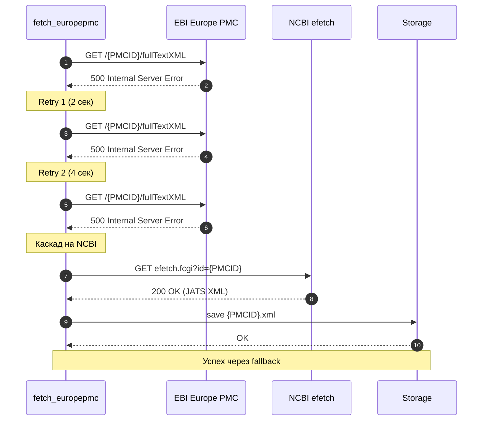
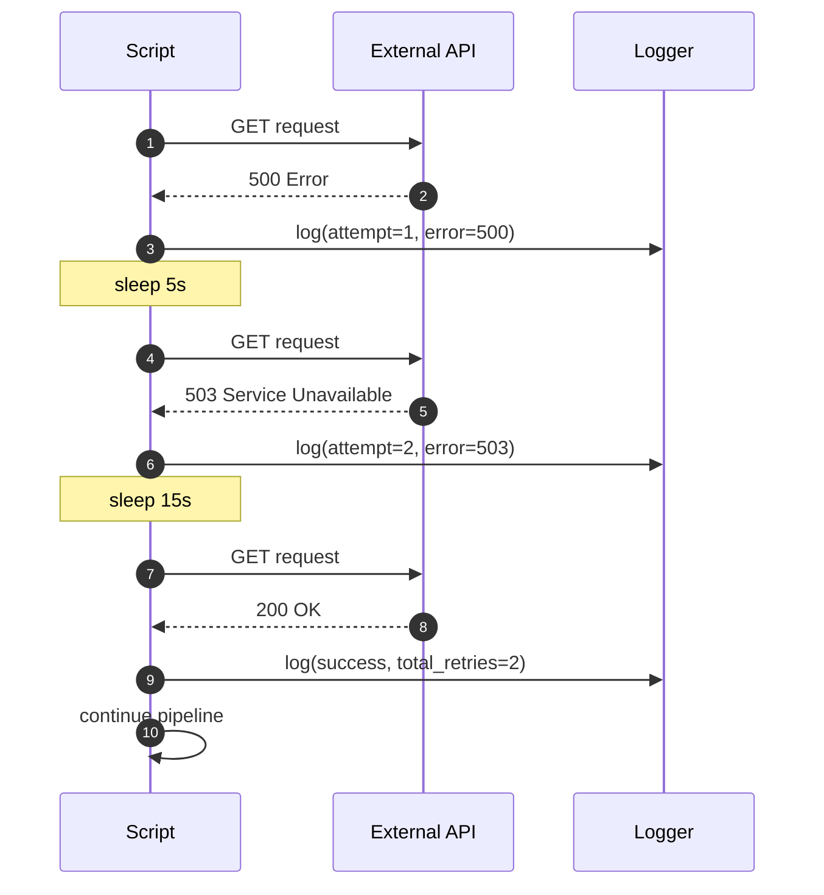
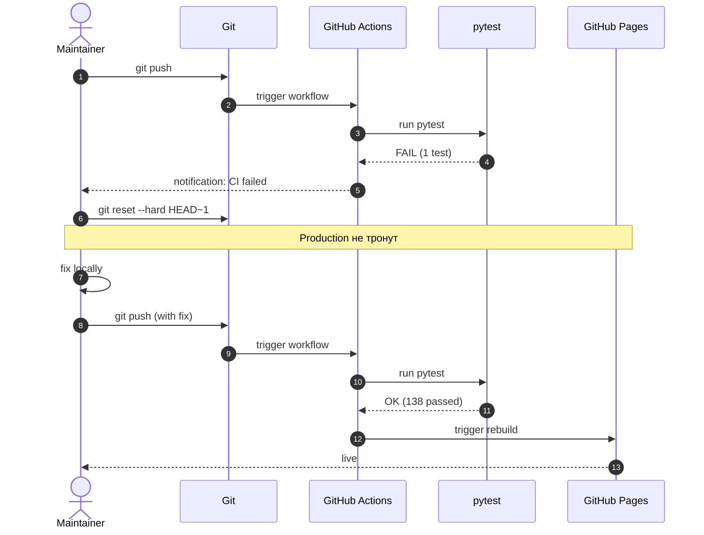
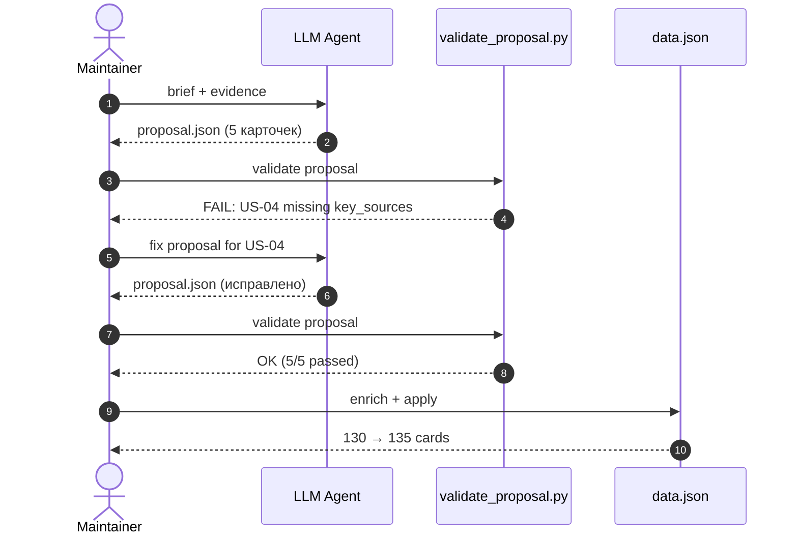
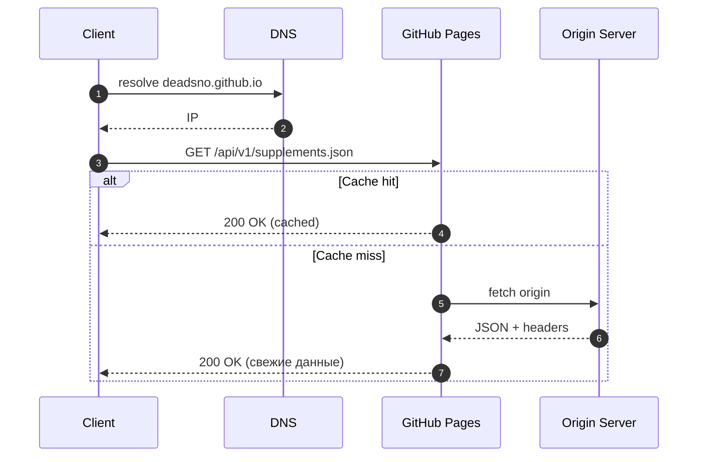

# Error Sequence — обработка сбоев

> Sequence-диаграммы для нештатных ситуаций. Показывает fallback-цепочки и retry-логику.
> Дополняет [BPMN pipeline](bpmn_pipeline.md) и [API Error Contract](api/v1/errors.md).

## 1. EBI отдаёт 500 → каскад на NCBI

**Результат:** покрытие 87% → 99.7% (см. [ADR-003](adr/003-ebi-ncbi-cascade.md)).

## 2. Общий сбой API — retry с exponential backoff

**Backoff:** 5s → 15s → 45s (×3). Макс 3 попытки. После — fail с уведомлением.

## 3. Провал тестов — откат коммита

**Ключевое:** production всегда на последней успешной версии. Откат — мгновенный.

## 4. Новая добавка — валидация не прошла

## 5. Cache miss — CDN fallback

## Матрица отказов и действий

| # | Отказ | Retry? | Fallback | Уведомление |
|---|-------|:------:|----------|-------------|
| 1 | EBI 500 | 3× | NCBI | Log |
| 2 | API 5xx | 3× | — | Alert |
| 3 | Tests FAIL | — | git reset | CI notification |
| 4 | Validation FAIL | — | review + fix | Local log |
| 5 | CDN miss | — | Origin | — |

## Связанные документы

- [BPMN pipeline](bpmn_pipeline.md)
- [API Error Contract](api/v1/errors.md)
- [ADR-003: EBI → NCBI cascade](adr/003-ebi-ncbi-cascade.md)
- [NFR — Доступность](nfr.md)

## Версия

- v1.0 — 2026-09-26, 5 сценариев отказа, 5 sequence-диаграмм
