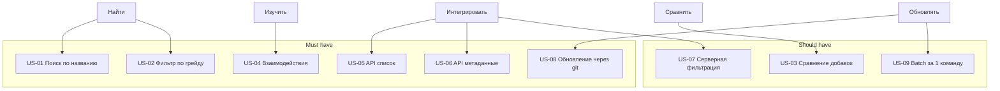

# User Story Map

> Визуальное представление всех User Stories по этапам пользовательского пути.
> Горизонтальная ось — этапы, вертикальная — приоритеты (MoSCoW).
>
> Связанные документы:
> - User Stories: [user_stories.md](user_stories.md)
> - SRS: [srs.md](srs.md)
> - RTM: [rtm.md](rtm.md)

## Карта (Mermaid)

## Матрица Этап x Приоритет

| Этап | Must have | Should have | Could have |
|------|-----------|-------------|------------|
| Найти | US-01, US-02 | — | — |
| Изучить | US-04 | — | — |
| Сравнить | — | US-03 | — |
| Интегрировать | US-05, US-06 | US-07 | — |
| Обновлять | US-08 | US-09 | — |

## Release Plan

### v1.0 (текущая)

| US | Что | Статус |
|----|-----|:------:|
| US-01 | Поиск добавки | done |
| US-02 | Фильтр по грейду | done |
| US-04 | Взаимодействия | done |
| US-05 | API список | done |
| US-06 | API метаданные | done |
| US-08 | Git-обновление | done |

### v1.1 (Should have)

| US | Что | Приоритет |
|----|-----|-----------|
| US-03 | Сравнение добавок | high |
| US-09 | Batch за 1 команду | medium |

### v2.0 (Backlog)

| US | Что | Причина отсрочки |
|----|-----|------------------|
| US-07 | Серверная фильтрация | Требует backend (v2) |

## Прогресс по эпикам

| Эпик | Всего US | Done | Partial | Not started |
|------|:--------:|:----:|:-------:|:-----------:|
| UI (пользователь) | 4 | 3 | 1 | 0 |
| API (разработчик) | 3 | 2 | 0 | 1 |
| Maintainer | 2 | 1 | 1 | 0 |
| **Итого** | **9** | **6** | **2** | **1** |

## Версия

- v1.0 — 2026-09-25, 9 US, 3 этапа, 3 релиза
